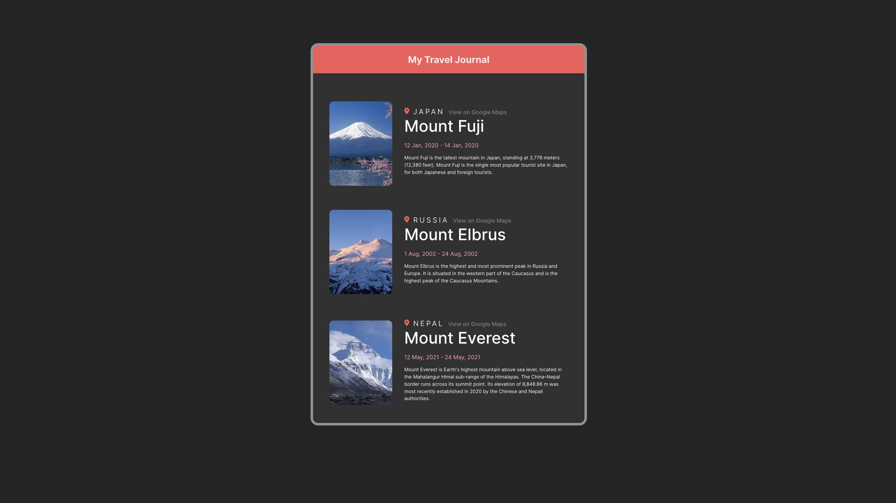

# Travel Journal

This assignment is a for the Scrimba React Course. The assignment is to create a travel journal using React and Vite. The project is deployed on Netlify and can be viewed [here](https://evgeniitraveljournal.netlify.app/).

## Tech Used

Tech specification for this template is given below

- [React](https://reactjs.org/)
- [React Icons](https://react-icons.github.io/react-icons/)
- [Vite](https://vitejs.dev/)
- [Netlify](https://www.netlify.com/)

## Sample IMG

# React + Vite

Based on default template, provides a minimal setup to get React working in Vite with HMR and some ESLint rules.

Currently, two official plugins are available:

- [@vitejs/plugin-react](https://github.com/vitejs/vite-plugin-react/blob/main/packages/plugin-react/README.md) uses [Babel](https://babeljs.io/) for Fast Refresh
- [@vitejs/plugin-react-swc](https://github.com/vitejs/vite-plugin-react-swc) uses [SWC](https://swc.rs/) for Fast Refresh

## Credits

- [Scrimba](https://scrimba.com/learn/learnreact)

#### Thank you for stopping by!

